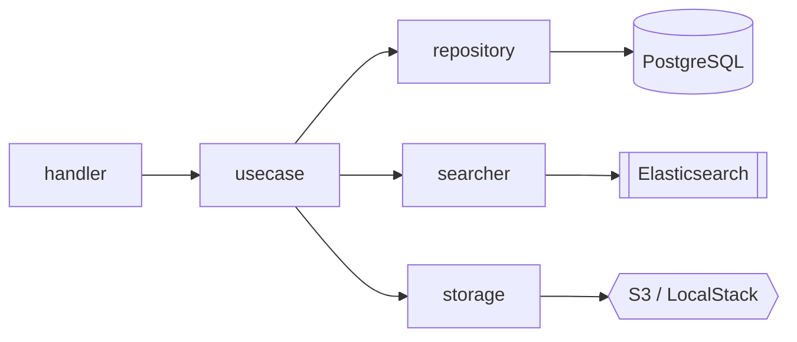
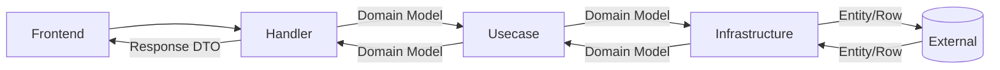

# Backend (Reci-Pin)

Go で構築されたレシピ管理アプリケーションのバックエンド API サーバーです。

## 技術構成 (Tech Stack)

- **Language**: Go 1.23+
- **Router**: chi
- **Database**: PostgreSQL
- **ORM/Query Builder**: Standard `database/sql` + `sqlc` (optional)
- **Search**: Elasticsearch
- **Storage**: AWS S3 (LocalStack in development)
- **Testing**: `testing` pkg, Uber Mock, golangci-lint

## アーキテクチャ

クリーンアーキテクチャの考え方を取り入れ、保守性とテスト容易性を高めるために以下の3層構造で実装されています。



### データフロー (Data Flow)

ドメインモデル（`internal/domain/model`）をアプリケーションの中心に据え、外部との境界で適切に変換を行うことで、ビジネスロジックの純粋性を保っています。



### ディレクトリ構造

```text
.
├── cmd/                # エントリーポイント（api, seed, sync_es など）
├── internal/
│   ├── domain/         # ドメイン層（エンティティ、リポジトリIF）
│   ├── usecase/        # ユースケース層（ビジネスロジック）
│   ├── server/         # サーバー層（ハンドラー、ルーティング）
│   ├── infrastructure/ # インフラ層（DB実装、外部サービス）
│   └── registry/       # DI コンテナ・依存解決
├── migrations/         # DB マイグレーションファイル
├── Dockerfile
└── Makefile
```

## 開発ガイド

Docker Compose を使用せずに、直接バックエンドを開発する場合の手順です。

### 前提条件

- **Go** (v1.23+)
- **PostgreSQL**, **Elasticsearch**, **LocalStack** (S3) が起動していること
  - ※ データベースなどのインフラのみを Docker で起動する場合は `docker-compose up postgres elasticsearch localstack` を実行してください。

### 1. 準備

```bash
make bootstrap
```

### 2. サーバーの起動

```bash
# デフォルトで localhost:8080 で起動
# 接続先の設定を .env や Makefile で調整が必要な場合があります
make app.run
```

### 3. その他のコマンド

- **ユニットテスト**: `make app.test`
- **リンター**: `make app.lint`
- **シード投入**: `make seed.run` (DBが起動している必要あり)
