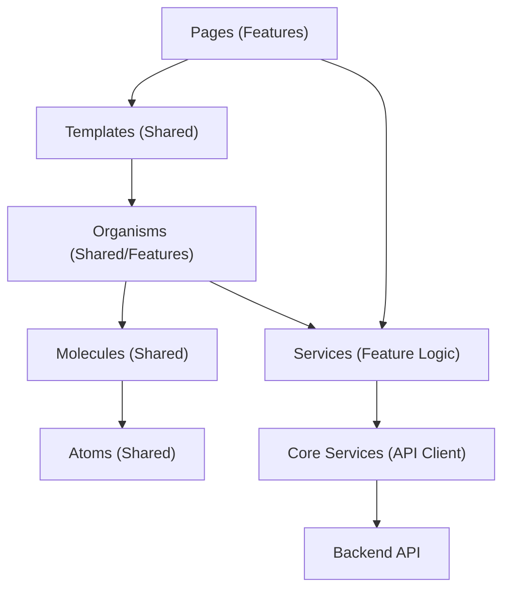
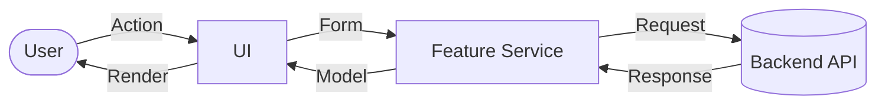

# Frontend (Reci-Pin)

Angular で構築されたレシピ管理アプリケーションのフロントエンドです。

## 技術構成 (Tech Stack)

- **Framework**: Angular 19.1.2
- **Language**: TypeScript
- **Styling**: SCSS, Angular Material, CSS Variables (Design Tokens)
- **Testing**: Vitest, Angular Testing Library
- **Documentation**: Storybook
- **Form Management**: Angular Reactive Forms

## アーキテクチャ

Angular の推奨される構成に従い、関心の分離を意識したディレクトリ構成を採用しています。



#### コンポーネント設計 (Atomic Design)

UI コンポーネントの可読性と再利用性を高めるため、**Atomic Design** の考え方をベースにしたコンポーネント構成を採用しています。

- **Atoms**: 最小単位のボタン、入力フォーム、アイコンなどの汎用パーツ。
- **Molecules**: Atoms を組み合わせた、特定の役割を持つ塊（検索バー、カードのヘッダーなど）。
- **Organisms**: ドメイン知識を伴う、より具体的で機能的なコンポーネント（ナビゲーションバー、レシピリストなど）。
- **Templates**: ページ全体のレイアウト構造を定義する枠組み。

#### スタイル管理 (Design Tokens)

一貫したデザインを維持し、メンテナンスを容易にするため、`src/styles/tokens/` 以下に定義された **Design Tokens** を全面的に採用しています。

- 色、余白、タイポグラフィ、角丸などの定数を CSS 変数（Custom Properties）として定義。
- 個別のコンポーネントではハードコードを避け、これらの変数を参照することで、テーマ変更や一括調整に強い設計としています。

### データフロー (Data Flow)

共通のモデル（`src/app/core/models`）を介してデータをやり取りし、API との境界で型安全な変換を行います。



### ディレクトリ構造

```text
src/app/
├── core/               # アプリケーションの基盤（ガード、インターセプター）
│   ├── models/         # 全体で共通のデータ型定義
│   ├── services/       # グローバルサービス（API クライアントなど）
│   └── styles/         # デザイントークン（CSS 変数）
├── features/           # 機能ごとのモジュール（auth, recipes, settings）
│   └── recipes/        # 機能固有のコンポーネント、サービス、モデル
├── shared/             # 複数の機能で再利用されるコンポーネント
│   └── components/     # Atoms, Molecules, Organisms
├── app.config.ts       # アプリケーション全体の設定
└── app.routes.ts       # アプリケーションのルーティング定義
```

## 開発ガイド

Docker Compose を使用せずに、直接フロントエンドを開発する場合の手順です。

### 前提条件

- **Node.js** (v20+)
- **Yarn**

### 1. 依存関係のインストール

```bash
yarn install
```

### 2. 開発サーバーの起動

```bash
yarn start
```

ブラウザで `http://localhost:4200/` を開いてください。
※ バックエンド API や Proxy と連携させて開発する場合は [Root README](../README.md) の Docker Compose 手順を推奨します。

### 3. その他のコマンド

- **コンポーネントの生成**: `ng generate component path/to/name`
- **ユニットテスト**: `yarn test`
- **Storybook**: `yarn storybook`
